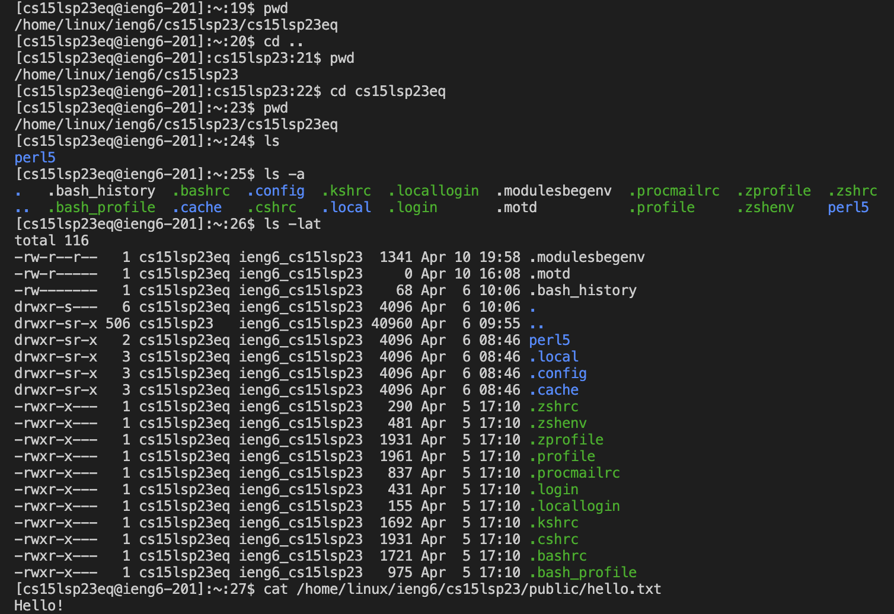

# Lab Report 1 - Remote Access and FileSystem
The aim of this tutorial is to outline the procedure for logging into a course specific account on ieng6. If you haven't already, go to [https://sdacs.ucsd.edu/~icc/index.php](https://sdacs.ucsd.edu/~icc/index.php) to look up your CSE 15L account. Visit this [tutorial](https://drive.google.com/file/d/17IDZn8Qq7Q0RkYMxdiIR0o6HJ3B5YqSW/view) to find instructions to reset your password. I have used the information provided at [https://ucsd-cse15l-s23.github.io/week/week1/](https://ucsd-cse15l-s23.github.io/week/week1/)) to help me write this blog. There are 3 main steps that need to be followed:
## 1) Installing VScode
Go to the Visual Studio Code website at [https://code.visualstudio.com/](https://code.visualstudio.com/) and install VScode on your device by following the instructions. Choose the correct downloading option based on your device's operating system. Since I had already downloaded VScode on my laptop, here is what it should look like when opened:


## 2) Remotely connecting
If you are using a windows device, install [git for windows](https://stackoverflow.com/questions/42606837/how-do-i-use-bash-on-windows-from-the-visual-studio-code-integrated-terminal/50527994#50527994) and use the steps in [this post](https://stackoverflow.com/questions/42606837/how-do-i-use-bash-on-windows-from-the-visual-studio-code-integrated-terminal/50527994#50527994) to enable ```git bash``` to be used by your default terminal.
Now, in a new terminal on VScode, paste the following ```ssh cs15lsp23zz@ieng6.ucsd.edu```.
Replace "zz" by the letters in your course specific account. Now, continue by logging in. If you are logging in for the first time, you may get a message that says "Are you sure you want to continue connecting?". Reply to this with "yes". Now, this is what the rest of the procedure looks like, along with the output that you should get after entering the password:


## 3) Trying some commands
After having logged in, try running a few commands like ``cd``, ``ls``, ``pwd``, ``mkdir``, and ``cp`` on your computer as well as on the remote computer after ssh-ing. Explore the commands by writing them in multiple ways with different combinations.

Here are a few commands that I ran and the output obtained:
- ``pwd`` - prints the working directory
- ``cd ..`` - changes the directory to the one 'outside' or 'above' the current directory
- ``cd ~`` - changes to the home directory
- ``ls`` - lists the files and floders in the current path
- ``cat`` - prints the content of the file(s)
- ``ls -lat`` - lists all files and directories in the current working directory



Following this simple 3-step procedure will ensure that you are connected to your course specific account seamlessly.
