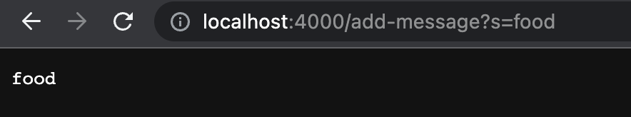
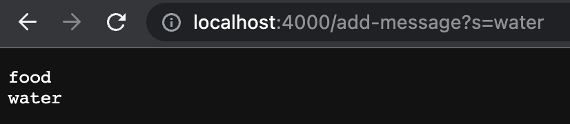
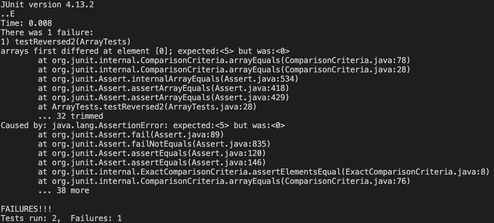

# Lab Report 2 - Servers and Bugs
## Part 1
For this part, a web server called ```StringServer``` was created which, based on incoming requests, prints strings on new lines.
The code for ```StringServer``` is as follows

```
import java.io.IOException;
import java.net.URI;

class Handler implements URLHandler {

    String message = "";

    public String handleRequest(URI url) {
        if (url.getPath().equals("/")) {
            return message;
        } else {
            System.out.println("Path: " + url.getPath());
            if (url.getPath().contains("/add-message")) {
                String[] parameters = url.getQuery().split("=");
                if (parameters[0].equals("s")) {
                    message += parameters[1] + "\n";
                }
                return message;
            }
            return "404 Not Found!";
        }
    }
}

class StringServer {
    public static void main(String[] args) throws IOException {
        if(args.length == 0){
            System.out.println("Missing port number! Try any number between 1024 to 49151");
            return;
        }

        int port = Integer.parseInt(args[0]);

        Server.start(port, new Handler());
    }
}
```
Here are 2 screenshots of using ```/add-message``` and an explanation of how they work

 
- The handleRequest method of the Handler class is called with an argument of the URI object representing the request URL. 
- The relevant argument to the handleRequest method is the URI object, which contains information about the request URL such as the path and query string.
- The relevant field of the Handler class is the message field, which initially has a value of "". After the request http://localhost:<port>/add-message?s=food is made, the value of the message field changes from "" to "food\n".
  

 
- The handleRequest method of the Handler class is called with an argument of the URI object representing the request URL.
- The relevant argument to the handleRequest method is the URI object, which contains information about the request URL such as the path and query string.
- The relevant field of the Handler class is the message field, which stores the current string being tracked by the server. From this specific request, the value of the message field changed from "food\n" to "food\nwater\n". This is because the new value "water" was concatenated with a new line character to the existing value "food" using the += operator.
  
## Part 2
In part 2 of this lab report involves using JUnit to identify buggy code and fix it. I will be using the method reversed(int[] arr) in ArrayExamples.java that we were provided in week 3.
A failure inducing input for this method:

```@Test
public void testReversed2() {
    int[] input1 = {0,1,2,3,4,5};
    assertArrayEquals(new int[]{5,4,3,2,1,0}, ArrayExamples.reversed(input1));
}
```
- An input that doesn't induce failure:

```@Test
public void testReversed1() {
    int[] input2 = {};
    assertArrayEquals(new int[]{ }, ArrayExamples.reversed(input2));
}
```
- The symptom, which is a screenshot of the output obtained when the above 2 tests are run:

    
Here, we see that after running the 2 JUnit tests as described above, there is 1 failure, which is caused by testReversed2(). The error is seen at the first element position (index 0), where the expected value is supposed to be 5, but it is 0, which is the default value of the elements in an int[] array. This symptom is caused by bugs in the code.
- Buggy code:
```
static int[] reversed(int[] arr) {
    int[] newArray = new int[arr.length];
    for(int i = 0; i < arr.length; i += 1) {
      arr[i] = newArray[arr.length - i - 1];
    }
    return arr;
  }
```    
This code is buggy because it assigns the values from the uninitialized newArray to the input Array and neither does it return the new array newArray. Instead, it returns the input array arr itself which now has the default 0 value as the value of all its elements.
                                  
Corrected code:
```
static int[] reversed(int[] arr) {
    int[] newArray = new int[arr.length];
    for(int i = 0; i < arr.length; i += 1) {
        newArray[i] = arr[arr.length - i - 1];
    }
    return newArray;
}
```
As seen in the code above, to fix the bug, the assignment in the loop should be ```newArray[arr.length - i - 1] = arr[i];``` to correctly copy the elements from arr into newArray in reverse order. Additionally, the method should return newArray instead of arr.

## Part 3
CSE 15L labs, in general, have been extremely fascinating to me due to the fact that I always get to learn and work with concepts I have little knowledge about. During weeks 2 and 3 I learnt many things that I had no prior exposure to. Specifically, creating a basic server and a search engine was something I enjoyed a lot. Like most people,I have been using complex search engines like Google almost everyday. The fact that I could create even such a simplified version was exciting for me. Additionally, going forward with these tasks and discussion with peers in the lab helped me enhance my coding skills and CS knowledge in general.   
