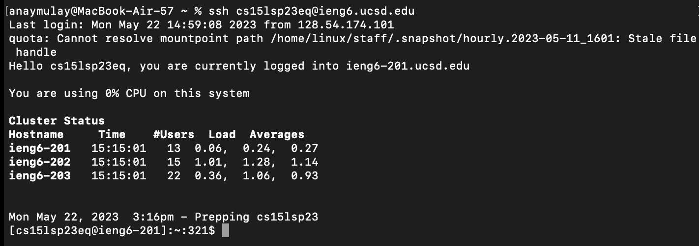
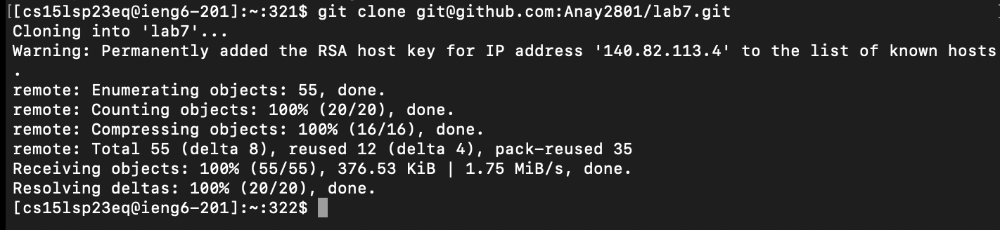
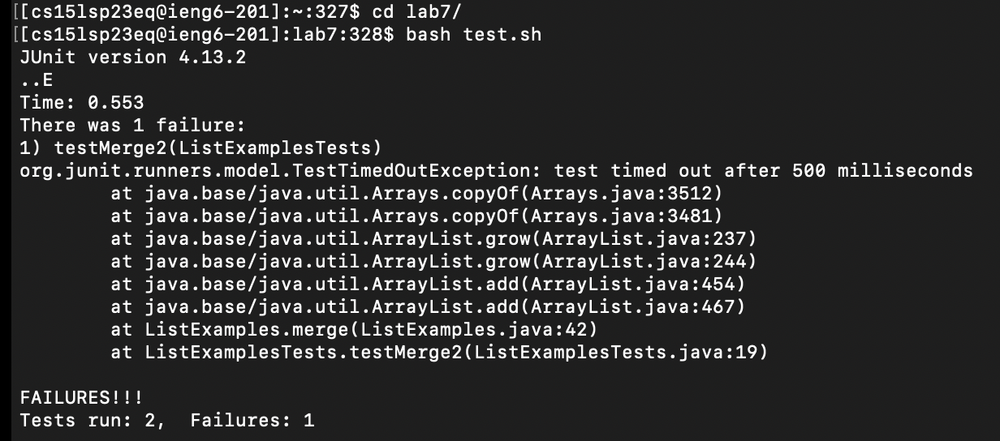
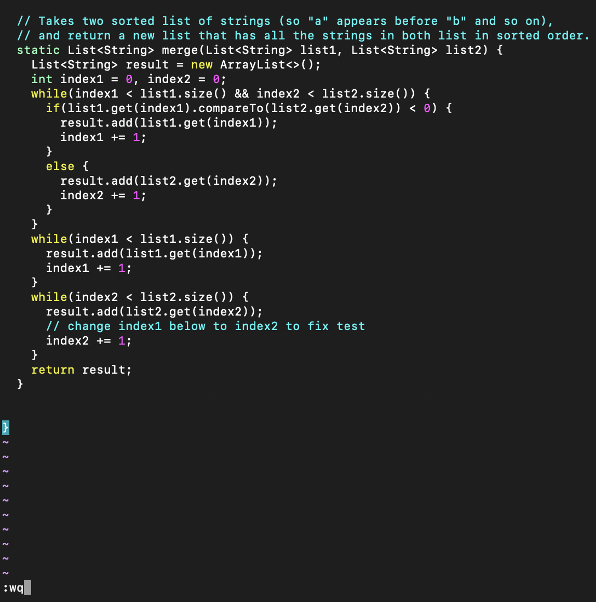
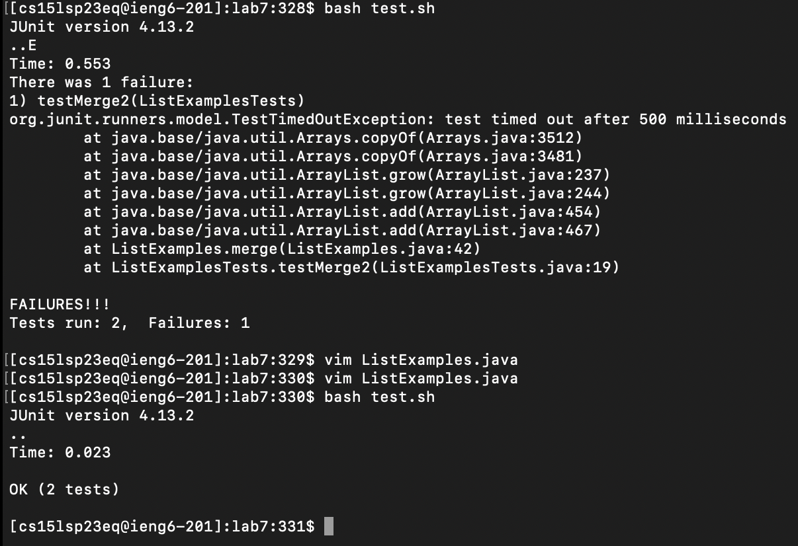
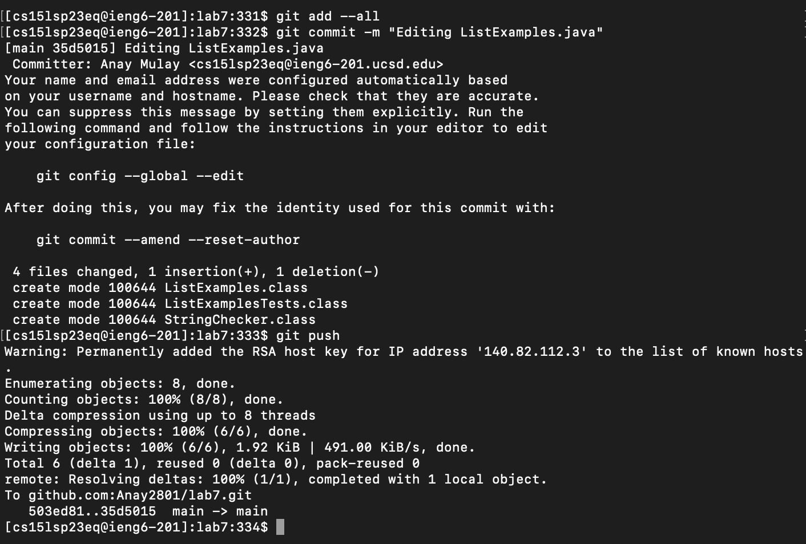

# Lab Report 4 - Vim
The aim of this lab report is to edit and run files from the command line using vim, and commit and push these changes onto one's Github account. There are 6 steps that can followed to achieve this objective:

## Step 1: Log into `ieng6`
Keys pressed: `ssh<space>cs15lsp23eq@ieng6.ucsd.edu<return>`

Explanation: I logged into my course-specific account on `ieng6` using the `ssh` command. I did not need to enter my password as I had generated an SSH key.

## Step 2: Clone your fork of the repository from your Github account
Keys pressed: `git<space>clone<space><command+v><return>`

Explanation: I cloned the fork of the lab 7 repository provided to us using `git clone` and pasted the `SSH` clone url from github account.

## Step 3: Run the tests, demonstrating that they fail
Keys pressed: `cdl<tab>,<return>`, `bash test.sh<return>`

Explanation: First, I entered into the directory called `lab7` using the `cd` command and pressed `l` followed by `tab` in order to reduce the characters typed. Then I ran `test.sh` using the `bash` command. This `test.sh` file compiles and runs `ListExamples.java`. Here is a screenshot showing the failed output:

## Step 4: Edit the code file to fix the failing test
Keys pressed: `vim<space>ListExamples.java<return>`,`/index1<shift+n>exi2<esc>:wq<return>`

Explanation: First, I open the file in vim using the `vim` command followed by the name of the files `ListExamples.java`. Then I look for the word `index1` in the file using `/` and pressed `shift+n` to look for the next instance of this word. I pressed `e` to go to the last character of the word `index1`, which is `1`. I pressed `x` to delete the `1` and entered insert mode using `i`. Then, I pressed `2`, which changed index1 to index2, thus fixing the bug. Finally, I entered normal mode using the escape key and saved and exited the file using `:wq<enter>`.

The following image shows me saving and exiting the file after making the edits described above:

## Step 5: Run the tests, demonstrating that they now succeed
Keys pressed: `<up><up><enter>`

Explanation: I pressed the up arrow twice to get the `bash test.sh` command on the command line, and then hit `<Enter>` to run it.
The following image shows the tests running successfully after making edits to ListExamples.java:

## Step 6: Commit and push the resulting change to your Github account
Keys pressed: `git<space>add<space>--all<enter>`, `git<space>commit<space>-m<space>"Editing<space>ListExamples.java"`, `git<space>push`

Explanation: First, I added all the files to my github using `git add --all`. Then I used `git commit` to commit the changes I made using the message `Editing ListExamples.java`. Finally, I pushed these changes to github using `git push`

The following image shows these commands and their output:

  
