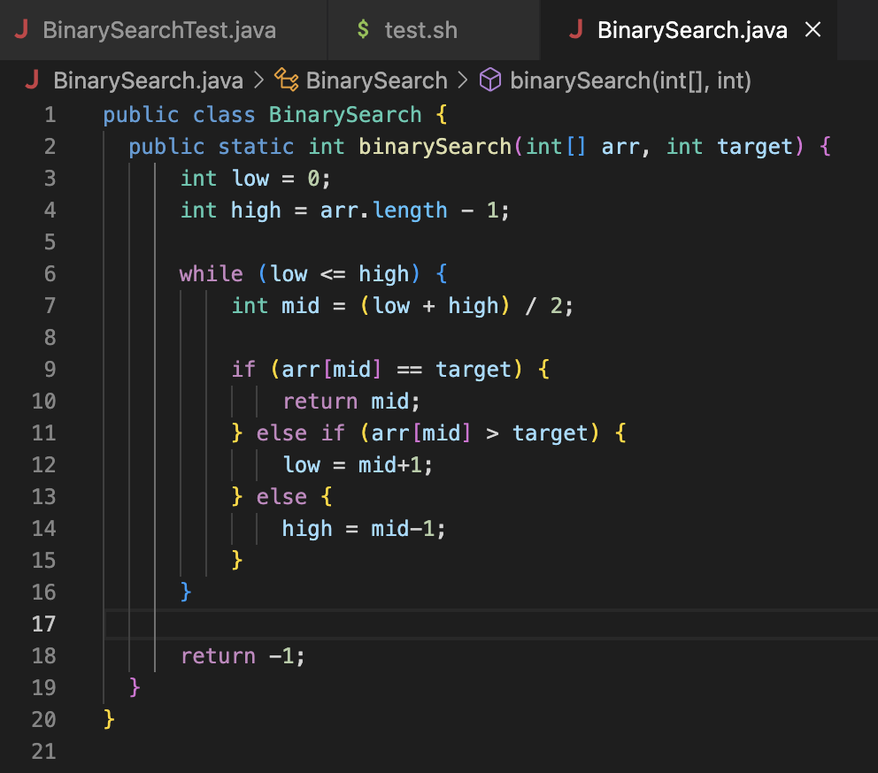
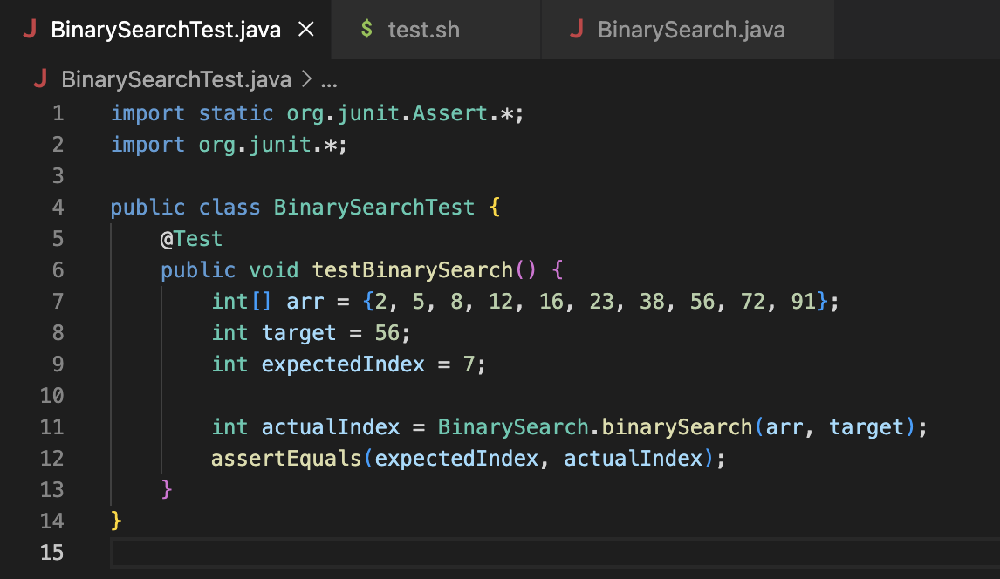
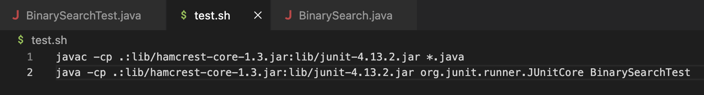
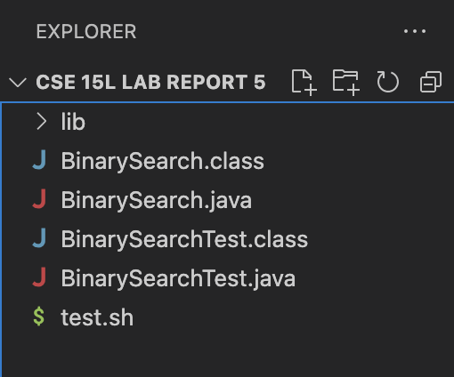
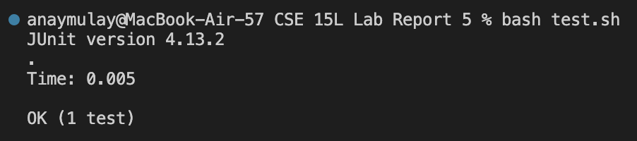

# Lab Report 5 - Putting it all together

## Part 1
### Post from the Student
**What environment are you using (computer, operating system, web browser, terminal/editor, and so on)?**

I am operating on macOS and using Visual Studio Code.

**Detail the symptom you're seeing. Be specific; include both what you're seeing and what you expected to see instead. Screenshots are great, copy-pasted terminal output is also great. Avoid saying “it doesn't work”.**

Hey, I have written an algorithm for binary search, however, it does not seem to return the correct index of the value being searched. Here is my code:



I tested it using the following JUnit test case:




**Detail the failure-inducing input and context. That might mean any or all of the command you're running, a test case, command-line arguments, working directory, even the last few commands you ran. Do your best to provide as much context as you can.**

I ran the JUnit test case above (which is the failure-inducing input) using the following the bash script:



### Response from the TA
Hi, I would like to draw ur attention to the conditional statements. There is a logical error in one of them. The aim is to narrow down the search area. By trying to understand the logic of the search, you should be able to correct the statement soon. A further hint: look at the else if statement. Let me know if you have any further questions!

### Student's response to the TA
Oh yes! It makes sense now. It should have been arr[mid] < target to correctly narrow down the search space when the target value is greater than the middle element. If the middle value is greater than the target element (as was in my buggy case), incrementing the value of low does not make sense.

### Final information
**File Structure:**



**Files Before Bug Fixes:**
**BinarySearch.java**
```
public class BinarySearch {
  public static int binarySearch(int[] arr, int target) {
      int low = 0;
      int high = arr.length - 1;

      while (low <= high) {
          int mid = (low + high) / 2;

          if (arr[mid] == target) {
              return mid; 
          } else if (arr[mid] > target) {
              low = mid + 1; 
          } else {
              high = mid - 1; 
          }
      }

      return -1; 
  }
}
```
**BinarySearchTest.java**
```
import static org.junit.Assert.*;
import org.junit.*;

public class BinarySearchTest {
    @Test
    public void testBinarySearch() {
        int[] arr = {2, 5, 8, 12, 16, 23, 38, 56, 72, 91};
        int target = 56;
        int expectedIndex = 7;

        int actualIndex = BinarySearch.binarySearch(arr, target);
        assertEquals(expectedIndex, actualIndex);
    }
}
```

**test.sh**
```
javac -cp .:lib/hamcrest-core-1.3.jar:lib/junit-4.13.2.jar *.java
java -cp .:lib/hamcrest-core-1.3.jar:lib/junit-4.13.2.jar org.junit.runner.JUnitCore BinarySearchTest
```

**The command on the terminal that induced the bug:**
```bash test.sh```

**BinarySearch.java after fixing the bug:**
```
public class BinarySearch {
  public static int binarySearch(int[] arr, int target) {
      int low = 0;
      int high = arr.length - 1;

      while (low <= high) {
          int mid = (low + high) / 2;

          if (arr[mid] == target) {
              return mid; 
          } else if (arr[mid] < target) {
              low = mid + 1; 
          } else {
              high = mid - 1; 
          }
      }

      return -1; 
  }
}
```

**Terminal after fixes:**


## Part 2 - Reflection
For me, the usage of Vim and the concept of doing all tasks from the command line was the most useful and interesting. Before this class, I had never heard of Vim. The fact that I could view and edit files in another computer (using ssh) was the useful and fascinating component of my lab experience in the second half of the quarter.
